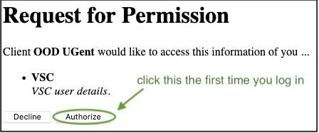
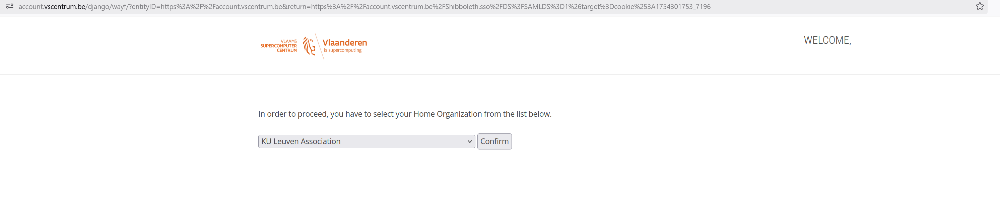
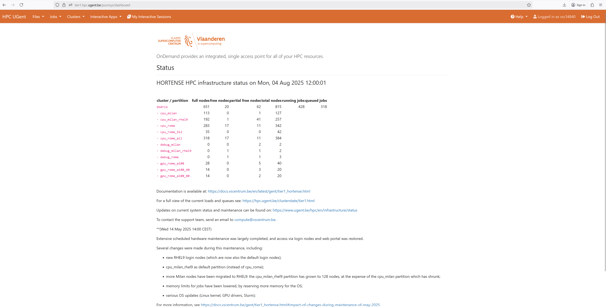

<!--

author:   Benjamin Pavie Bruna Piereck Tatiana Woller
email:    trainingandconferences@vib.be
version:  1.0.0
language: en
narrator: UK English Female

icon:     https://vib.be/sites/vib.sites.vib.be/files/logo_VIB_noTagline.svg

comment:  This document shall provide an entire compendium and course on the
          development of Open-courSes with [LiaScript](https://LiaScript.github.io).
          As the language and the systems grows, also this document will be updated.
          Feel free to fork or copy it, translations are very welcome...

script:   https://cdn.jsdelivr.net/chartist.js/latest/chartist.min.js
          https://felixhao28.github.io/JSCPP/dist/JSCPP.es5.min.js

link:     https://cdn.jsdelivr.net/chartist.js/latest/chartist.min.css
link:     https://cdnjs.cloudflare.com/ajax/libs/animate.css/4.1.1/animate.min.css
link:     https://raw.githubusercontent.com/vibbits/material-liascript/master/img/org.css
link:     https://cdnjs.cloudflare.com/ajax/libs/font-awesome/5.11.2/css/all.min.css
link:     https://fonts.googleapis.com/css2?family=Saira+Condensed:wght@300&display=swap
link:     https://fonts.googleapis.com/css2?family=Open+Sans&display=swap
link:     https://raw.githubusercontent.com/vibbits/material-liascript/master/vib-styles.css

tutor: TCP
edition: 1st 

-->

# Chapter0 : Setup

Please read this page carefully **before** the start of the workshop.

In this session you will find what you need to install in your computer additionally to complementary training material to be completed prior to course.

## 1. Set your VSC account

**a. Register** for an [HPC account](https://docs.vscentrum.be/access/vsc_account.html) before the course since it might take some time to process and activate. 

>
> P.S.: If you are from industry or in any other situation where you are not linked to an academic institution we can only help you get an account when registered in the workshop, check avaiability in [the website](https://www.vibtrainingandconferences.be/#/).
>
> In that case the trainer needs to request a temporary account for you to participate in the training activities.
>

Once you have an account, you can [access it](https://account.vscentrum.be/), and you will be able to see your VSC ID, and other information about your account. Eventually you might want to add an SSH key to connect remotely. You will not need this for this session.

**b. Test** your account and accept the invitation to reservation:

*You should receive an email from the VSC (`hpc@ugent.be`) granting you access to the group (e.g. `gpr_compute_2024_300`)*

**Connecting at Tier1 instance of VSC**

Visit [login page](https://auth.vscentrum.be/auth/login)  the 1st time you do it permission will be requested to let the web portal access some of your personal information, authorize it!!  Once logged in, you should see this start page!

<center></center>
<center></center>

Once you are logged in, you should see this page:

<center></center>

All good, you can get started!

## 2. Install Globus Personnal Connector on your PC


### Windows

- download `Globus Connect Personal` and follow the next steps: https://docs.globus.org/globus-connect-personal/install/windows/
- install `Globus Connect Personal` in a place where you have admin rights or check if it is white listed by your local IT
### Linux

Documentation can be found here : https://docs.globus.org/globus-connect-personal/install/linux/

- open a terminal and follow the next steps
```bash
# you need admin rights to do the following steps
sudo apt-get install tk tcllib
cd Downloads
wget https://downloads.globus.org/globus-connect-personal/linux/stable/globusconnectpersonal-latest.tgz
mv Downloads/globusconnectpersonal-latest.tgz Documents/
cd Documents
tar xzf globusconnectpersonal-latest.tgz
# replace `x.y.z` in the line below with the version number you see
cd globusconnectpersonal-x.y.z
./globusconnectpersonal
```
- Then you can login and use the globus portal

All good, you can get started!


