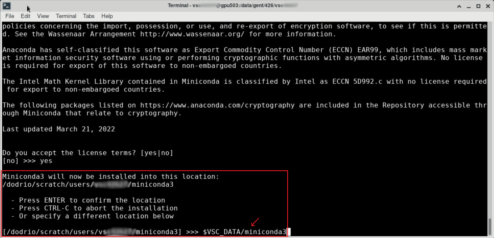
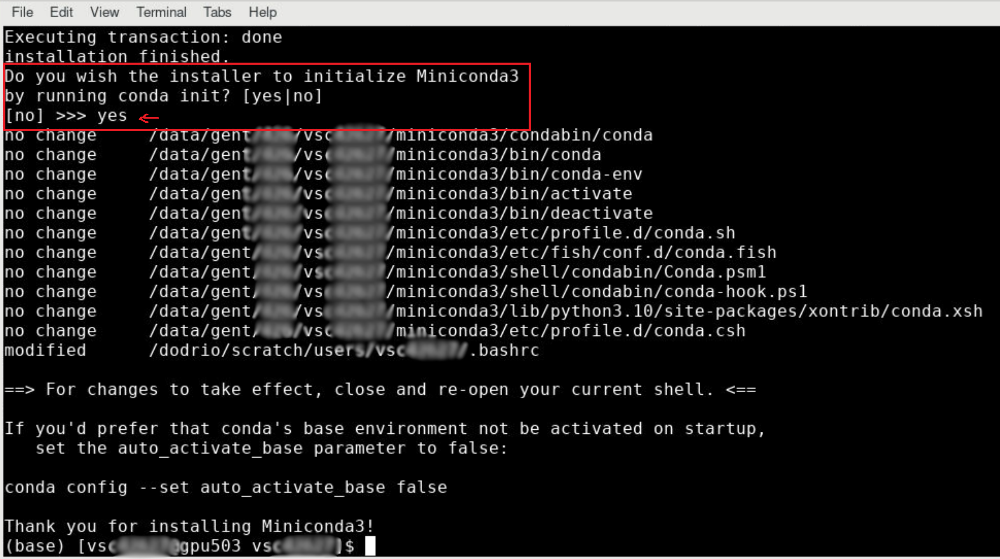

# Chapter 5 : Python and Notebooks

## Why should I use this
- Run Interactive Code
- In a web browser (Chrome/Firefox/Safari/…)
- Combine Code (Python), Text (Markdown) and Visualization in a single document
- Ideal to explore Bio-Image Analysis
- 3 flavors :

| VSCode Server    | Jupyter | JupyterLab |
| -------- | ------- | ------- |
|  |  |  |

All 3 are available on Tier 1 via the On Demand interface


In this tutorial, we will focus on **VS Code Server**

## Which infrastructure to use
### Using pre-installed libraries
- EasyBuidl Modules : if you can work with centrally installed softwares (modules), you can use either VS Code Server, Jupyter notebook or Jupyterlab.
### Using custom libraries 
In case, you need more specific python librairy, you can:
- Use venv and use it with VS Code Server. In that case, you can mix **easybuild** modules **and** extra **pip** packages
- Use conda : Install a miniconda and create your own conda environment with **conda** and/or **pip** packages

## VS Code Server and EasyBuild Modules

### Why VS Code Server
- (VS)Code Server use the same interface as VSCode
- EasyBuild Modules so you have nothing to install yourself (
See [here](https://github.com/vib-bic-training/HPC_bioimage_analysis/blob/main/Chapters/chapter4.md) to search available modules).

### Demo 
In this demo, we will segment with Cellpose uisng the pre-installed module.

1. Connect to the login node


2. In the terminal, search for the cellulose module and identify it


```bash
module spider Cellpose
Cellpose/2.2.2-foss-2022a
```
3. Relate the module version with the right GCC

| FOSS  | GCC |  CUDA | OpenMPI | OpenBLAS | FFTW | ScaLAPACK |IPython|Python|
| ------| --- | ----- | ------- | -------- | ---- | --------- | --------- | --------- |
| 2024.05 | 13.3.0| 12.4.0-12.6.0| 5.0.3| 0.3.27| 3.3.10 | 2.2.0-fb | - | -|
| 2023b | 13.2.0 | 12.4.0-12.6.0| 4.1.6 | 0.3.24 | 3.3.10  | 2.2.0-fb | 7.2.0-GCCcore-13.2.0|3.12.3| 
| 2023a | 12.3.0 | 12.2.0| 4.1.5| 0.3.23| 3.3.10  | 2.2.0-fb |  7.0.2  GCCcore 12.3.0|Python 3.11.3  |
| 2022b | 12.2.0 | 12.0.0 | 4.1.4 | 0.3.21 | 3.3.10 | 2.2.0-fb | 7.0.3  GCCcore 12.2.0 | Python 3.10.8 |
| **2022a** | **11.3.0** | 11.7.0 | 4.1.4 | 0.3.20 | 3.3.10 | 2.2.0-fb |**8.5.0  GCCcore 11.3.0**  |  **Python 3.10.4**|
| 2021b | 11.2.0 | - | 4.1.1 | 0.3.18 | 3.3.10 | 2.1.0-fb | 6.4.0  GCCcore 11.2.0| Python 3.9.6 |
| 2021a | 10.3.0 | - | 4.1.1 | 0.3.15 | 3.3.9 | 2.1.0-fb |7.25.0 GCCcore 10.3.0 | Python 3.9.5 |

4. Start a new session with pre-loaded modules using the following parameters

- Cluster : `dodrio gpu_rome_a100`
- Time : `1 hour`
- Number of node : `1`
- Number of Core : `8`
- Number of GPU : `1`
- Code server version : `4.103.2`
- Working directory : `/dodrio/scratch/projects/2024_300`
- Custom Code : 
```bash
module load AICSImageIO/4.14.0-foss-2022a
module load matplotlib/3.5.2-foss-2022a
module load Cellpose/2.2.2-foss-2022a
```
-	Reservation ID : `vib_bioimaging`


5. Load the jupyter notebook
Load the jupyter notebok located in `/dodrio/scratch/projects/2024_300/training/2025/notebooks/modules_cell_segmentation_cellpose.ipynb`


6. Save a copy in your folder

Save it into your folder, e.g. `/dodrio/scratch/projects/2024_300/username`


7. Open the Notebook, and display the Terminal


8. Identify the current python in the terminal

In the terminal, check the python version running
```bash
which python
```


9. Select the right Python
Select the correct version of python, here `Python 3.10.4`


9. Run the notebook cell by cell

For it, put your mouse over the code block and click on the run button


## Conda environments

### Miniconda3 installation
```
cd $VSC_DATA
wget https://repo.anaconda.com/miniconda/Miniconda3-latest-Linux-x86_64.sh
chmod +x Miniconda3-latest-Linux-x86_64.sh
./Miniconda3-latest-Linux-x86_64.sh
```
The installer will show the license agreement. Read and accept it. When asked for the desired Miniconda installation location, do *not* accept the default path but instead enter `$VSC_DATA/miniconda3`. The default installation folder would be your home folder, whose disk space is too limited. 



When asked "Do you wish the installer to initialize Miniconda3 by running conda init? [yes|no]", answer `yes`.



When the installation has finished,

- restart your environement: `. ~/.bashrc` so conda command will be set in your path
- run

```
conda config --set auto_activate_base false
```

in the terminal. This will avoid activating the base conda environment automatically every time a new terminal window is opened.


Open a new terminal window. No conda environment should be activated yet. You can activate the default environment with:

```
conda activate
```

The terminal prompt should then change to something like `(base) [vsc12345@gpu123 ~]$ `

### Create a new conda environment

A new conda environment can now be created as usual, and Python packages can be installed in it.

```
conda create --name my-conda-env
conda activate my-conda-env
pip install apythonpackage
```

Alternatively, if you have a conda environment yaml file, the environment can be created from it, like so:

```
conda env create -f environment.yml
```

To list the available conda env or to get more info about the conda installation, type:
```
conda env list
conda info
# to remove an environment
conda env remove -n myenv
```
 To create a kernel for jupyter notebook:

 ```
source activate myenv
conda install ipykernel
python -m ipykernel install --user --name myenv --display-name myenvsDisplayName 
```

> [!NOTE]
> 
> - `--name` : conda environment name
> - `--display-name` : Name which will appear as a kernel name in the jupyter notebook
> 

> [!TIP]
> 
> you can pull from public and private repositories from github on VSC and then build a conda env from the yaml of the repo. In addition, you can also push back your code.
>
> ``` git clone any_repository```
>

## Venv environments

venv will alow you to combine pip package with easybuild modules by first loading the Python Module (see [VSC doc](https://docs.vscentrum.be/compute/software/python_package_management.html))

```
# choose the right python version
module load   Python/3.11.3-GCCcore-12.3.0
module load  PyTorch/2.1.2-foss-2023a-CUDA-12.1.1
module load torchvision/0.16.0-foss-2023a-CUDA-12.1.1
module load matplotlib/3.7.2-gfbf-2023a
module load scikit-image/0.22.0-foss-2023a
# load vsc-venv
module load vsc-venv
python -m venv training_napari
source training_napari/bin/activate
pip install bioio bioio-czi bioio-ome-tiff pandas==2.0.3
pip install cellpose==4.0.6
pip install "napari[all]"
pip install ipykernel
python -m ipykernel install --user  --name bioio --display-name bioioczi 
```


## Jupyter notebook
## How to start Jupyter notebook
Go to [the Open On Demand portal](https://tier1.hpc.ugent.be/) and log in after multifactor-authentification

Select **Jupyter notebook** or Jupyterlab (maybe more **Jupyter notebook** since you can modify the `Working Directory`) with the following specifications: 


How to list existing kernels and how to remove them:
```
!jupyter kernelspec list
!jupyter kernelspec uninstall  pycudadecon -y
```


Required modules:
- `module load n2v/0.3.2-foss-2022a-CUDA-11.7.0`
- `module load matplotlib/3.5.2-foss-2022a`

## Get the notebook
The notebooks are located in https://github.com/vib-bic-training/HPC_training_bioimaging_1/tree/main/code/notebooks

Download both of them and upload them to your local storage on the VSC using the jupyter interface:


Then double click on the notebook `n2v_demo_01_training.ipynb` to open it and edit it to change `output_folder`:
```python
output_folder = '/dodrio/scratch/projects/2024_300/<YOUR_NAME>/nv2' #TO CHANGE
```

> [!TIP]
> 
> you could select another place as a `Working Directory`, byt modifying the value when you configure the launch of the jupyter interface
>
> 
> 

## Jupyterlab
- not working properly with modules of 2022a and not loading napari modules

## VSCode server
The advantage of vscode is that you don't need to fix the python version in advance and you can also run other programming languages beside Python (i.e. Groovy, R, Julia, Rust, C/C#/C++).

### How to start VSCode
To start vscode, select code server (nb: on Tier2 KUL: it would be called vsc code server):


Then, select the right account, the right workdir and the appropriate queue with the amount of CPU and GPU (in this example, it is CPU only)


### How to start a terminal and set-up

Here is how to open a terminal:


To change from folder, you can click on File > Open new folder

Nota bene: you can also install additional extension for GIT, Nextflow and docker by clicking on the extension icon (cube).

### How to run a jupyter notebook with a specific pre-build conda env

To run a specific notebook with a specific python environment, open the python notebook and then select the kernel on the top right side and click on python environment.


You can either make a new environment or use an existing one:


Then you should be able to import your python librairies


## Additional resources

### VSC reference on Python
- https://docs.vscentrum.be/compute/software/python_package_management.html
- https://docs.hpc.ugent.be/Windows/jupyter/
- https://docs.hpc.ugent.be/Windows/python/

### Jupyter Notebook 
- Deep learning : https://github.com/HenriquesLab/ZeroCostDL4Mic 
- Pipeline: https://github.com/BiaPyX/BiaPy
​- Super-resolution imaging: https://github.com/HenriquesLab/NanoPyx 

### Napari notebooks: ​
- https://github.com/BiAPoL/Bio-image_Analysis_with_Python
- https://biapol.github.io/PoL-BioImage-Analysis-TS-GPU-Accelerated-Image-Analysis/intro.html
- https://biapol.github.io/PoL-BioImage-Analysis-TS-Early-Career-Track/intro.html
- https://github.com/FrancisCrickInstitute/cbias-napari

#### BIC code
- notebooks: https://github.com/vib-bic-code/notebooks
- conda environment: https://github.com/vib-bic-code/conda_environments

### Bioimage model zoo :​
- General one: ​ https://bioimage.io/#/​

[previous chapter](https://liascript.github.io/course/?https://raw.githubusercontent.com/vib-bic-training/2024_Bioimaging_data_analysis_on_HPC/refs/heads/main/Chapters/Chapter04.md) | [next chapter](https://liascript.github.io/course/?https://raw.githubusercontent.com/vib-bic-training/2024_Bioimaging_data_analysis_on_HPC/refs/heads/main/Chapters/Chapter06.md)
